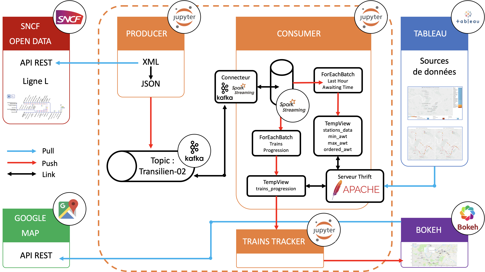
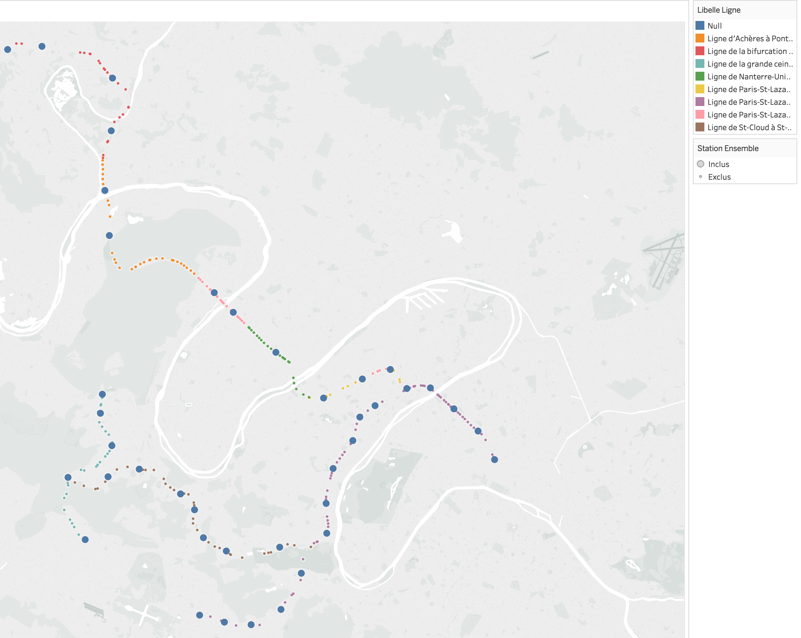
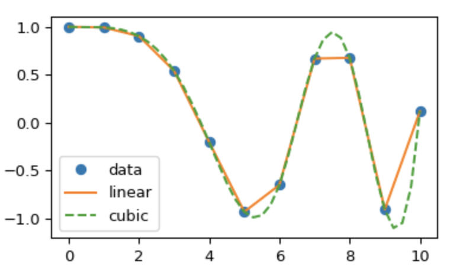

Présentation du projet Hadoop - Transilien
=============================

P.Hamy, N.Leclercq, L.Poncet
--

Sommaire
==========

1. Schéma du projet
2. Présentation des notebooks
3. Position des trains & Tableau Desktop
4. Points marquants

Schéma du projet
==========

  

Présentation des notebooks
==========

1. Producer
2. Consumer

Position des trains & Tableau Desktop
==========

1. Interpolation de la position des trains

  

  

2. Tableau Desktop

Quelques détails d'implémentation 
==========
1. Fonctions UDF de Spark
2. Serveur Thrift & Vues temporaires
3. Activité Asynchrone dans un Notebook Jupyter

Merci pour votre attention !
==========
