Rapport de projet Hadoop - Transilien
=============================

P.Hamy, N.Leclercq, L.Poncet
--

Introduction
==========

Le but de ce projet est de mettre en œuvre les différents outils de l'écosystème Hadoop en utilisant la Sandbox [Hortonworks HDP](https://www.cloudera.com/downloads/hortonworks-sandbox.html) ainsi que l'outil de visualisation [Tableau](https://www.tableau.com/).

Les données utilisées sont celles de l'[API temps réel Transilien](https://ressources.data.sncf.com/explore/dataset/api-temps-reel-transilien/information/). Nous nous intéressons en particulier à la ligne L dont nous allons calculer en temps réel les temps d'attente moyens par station et la position des trains sur la ligne et visualiser ces résultats dans Tableau.

La solution décrite permet de répondre à l'ensemble des questions du cahier des charges - bonus inclus. Une solution alternative de visualisation de la position des trains est proposée dans le notebook Jupyter du *consumer* en utilisant la librairie [Bokeh](https://bokeh.pydata.org/en/latest/) et Google Maps.

Installation
=========

Les instructions complètes d’installation et de configuration du projet sont fournie sur le dépôt github sous forme de fichier markdown dans le dossier [install](../../install).

**Les points principaux sont rappelés ci-après :** 
* Installation de la Sandbox HDP Hortonworks ;
* Configuration de la timezone de la Sandbox ;
* Installation des paquets et dépendances (Miniconda, Git, JupyterLab) ;
* Configuration de JupyterLab ;
* Configuration de Git ;
* Configuration de la durée de rétention des messages dans Kafka.

**Sur la machine locale :**
* Récupération du repository git ;
* Configuration de Tableau Software.

Travail préliminaire
====================

Création du fichier ``transilien_ligne_l_by_code.json`` contenant la liste des stations de la ligne L, ainsi que leur nom et leur position géographique.
 
**Les étapes principales sont les suivantes :** 

* Téléchargement et enregistrement dans des fichiers .JSON suivants depuis 
[le site open data SNCF](https://ressources.data.sncf.com/) : 

| Fichier                    | Description         |
| :--------------------------| :-------------------|
|``sncf-lignes-par-gares-idf.json``|Liste des lignes passant par chaque station du réseau transilien.|
|``sncf-gares-et-arrets-transilien-ile-de-france.json``|	Liste des stations du réseau avec les coordonnées géographiques. |

* Tri dans les données : conservation des stations de la ligne L uniquement (code_uic et nome de la station), ajout des données d'une station manquante, tri par ordre croissant des stations ;
* Ajout des coordonnées GPS des stations.


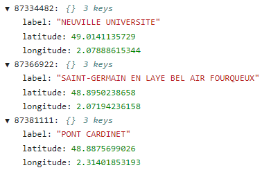

Producer Kafka
==============

L'ensemble des opérations décrites ci-après correspondent au code du [notebook api-transilien-producer.ipynb](../../api-transilien/api-transilien-producer.ipynb)

**Les étapes principales sont les suivantes :**

* L'API transilien renvoie au formal XML les heures de passage des prochains trains à la station pour laquelle on a fait une requête. On obtient pour chaque train les informations suivantes : numéro du train, date et heure de passage, mission, terminus du train.
* Transformation des données XML en dictionnaire python à l'aide de ``xmltodict``. Suppression des trains n'appartenant pas à la ligne L (ceux pour lesquels le terminus ne fait pas parti des stations de la ligne L). Réagencement des données dans le dictionnaire. Conversion au format JSON grâce aux classes ``Converter`` et ``JsonConverter``.
* Utilisation de la class ``KafkaProducerTask`` pour alimenter Kafka en donnée.


Utilitaires
------------

On a recours aux utilitaires suivants :
* **Task** : classe permettant d'exécuter périodiquement une requête à l'API transilien et l'envoi dans un stream Kafka ;
* **NotebookCellContent** : classe permettant de router les logs vers une cellule cible du notebook ;
* ** *Logging* ** : event logging en utilisant la bibliothèque python [logging](https://docs.python.org/3/library/logging.html)  ;
* **Credentials** : enregistrement dans le fichier ``api_transilien_login.json`` de nos trois couples login / mot de passe d'accès à l'API Transilien.

Description des Classes
----------------------------

### TransilienAPI
Cette classe a les deux fonctions principales suivantes : 
* Faire des requêtes sur l'API transilien ;
* Convertir les données reçues au format XML en JSON.

### Converter et JsonConverter
Les classes filles de Converter ont pour rôle de convertir les données préformatées par l’API transilien en un format différent. JsonConverter hérite de Converter et prend en charge le format JSON.

### KafkaProducerTask
Cette classe exécute périodiquement une requête sur l’API transilien et injecte les données retournées dans un stream Kafka.

Producer Kafka
-------------------

Pour la configuration du *producer*, on utilise un dictionnaire contenant les informations suivantes : 
* Niveau de débogage ;
* Nom du fichier ``api_transilien_login_json`` ;
* Adresse et port du bootstrap server ;
* Topic Kafka ;
* API polling period.


On instancie un ``KafkaProducerTask`` en lui passant en paramètres ce fichier de configuration et on lance ce *producer* de façon asynchrone.

Pour faire les requêtes à l’API Transilien, on itère sur nos login/mdp et sur les stations. Chaque exécution fera autant de requêtes que de couples login/mdp et pour une station différente à chaque fois :

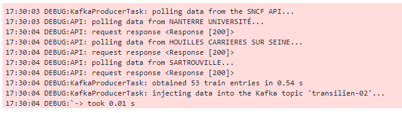

Consumer Kafka
==============

Partie I : Calcul moyen du temps d'attente moyen par station
---

On explique dans cette partie la façon dont on répond à la question du calcul du temps moyen d'attente par station sur toute la ligne.

Les étapes principales sont les suivantes : 
* Import des packages (dont ``SparkSessions`` depuis ``pyspark.sql`` ; ``Window`` depuis ``pyspark.sql.window``) ;
* Mise en place du *logging* (utilisation de ``NotebookCellContent`` défini plus haut, et de [Py4J](https://www.py4j.org/)) ;
* Création d'une session Spark ;
* Création d'un [Structured Spark Stream](https://spark.apache.org/docs/latest/structured-streaming-programming-guide.html) à partir d'un flux Kafka ;
* Désérialisation et formatage des messages grâce à la fonction Spark ``fromJson`` :
    * Utilisation d'un schéma JSON ;
    * Définition du format des *timestamp*.
 * Configuration de la fenêtre : *watermark*, *window length*, *sliding interval* ;
 * ``GroupBy`` par station et pour la fenêtre définie ;
* Suppression des doublons de couples {train, heure de départ} ;
* Création d'une aggrégation contenant : 
    * le nombre *nt* de trains sur la période 
    * le temps moyen *awt* d'attente sur la période
  
  

Partie I & II : Calcul des temps d'attente et de la progression des trains
--

L'impossibilité de réaliser plus d'une opération d'aggrégation sur le stream nous a obligé à trouver une solution de contournement afin de réaliser toutes les requêtes demandées. Pour cela, on effectue les calculs sur chaque *batch* et enregistrons les résultats sous forme de *vues temporaires* via un serveur **thrift**. Les détails sont données pas à pas dans le notebook [notebook api-transilien-consumer.ipynb](../../api-transilien/api-transilien-consumer.ipynb)

### Classe *TransilienStreamProcessor*
Cette classe implémente l'intégralité des fonctionnalités pour les parties I et II du projet.

* Partie I : 
    * *setup_last_hour_awt_stream*
    * *computeAwtMetricsAndSaveAsTempViews*
*  Partie II : 
    * *setup_trains_progression_stream*
    * *computeTrainsProgressionAndSaveAsTempView*

### Étapes principales de fonctionnement du *consumer* 
* Import des packages Python requis
* Mise en place du *logging*
* Définition de paramètres de configuration :
    * Schéma et options de désérialisation
    * Options de la session Spark
    * Source Kafka (broker et topic)
    * Fenêtre du stream Kafka
    * Configuration du serveur Thrift local
* Instanciation de la classe *TransilienStreamProcessor*


Interpolation de la position des trains
--------------------

Les positions des trains étaient initialement calculées via une simple règle de trois à partir de :
* La position de leur gare de départ ;
* La position de leur gare d'arrivée ;
* Leur progression.

Nous avons évoqué cette position comme la position **courante** au sein de ce document.

Cependant, dans le cas de trains directs entre des gares éloignées, ils pouvaient apparaitre à des emplacements aberrants (dans la Seine, sur des champs, etc.).

Nous avons donc utilisé les informations du fichier **scnf-paths-line-l.json** afin d'interpoler leur position sur les voies ferrées via *Scipy*. Voici un exemple d'interpolation :

  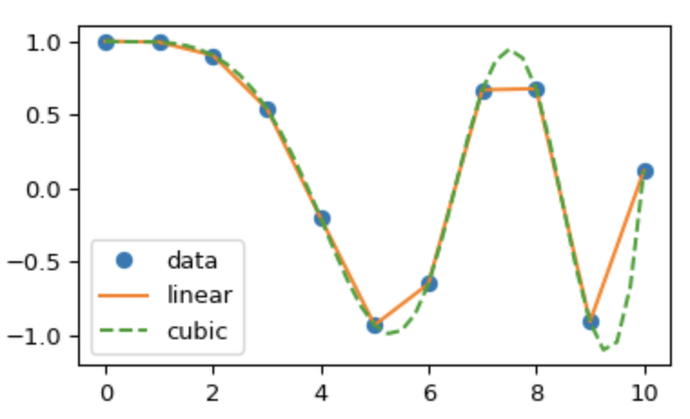

Au sein de ce rapport, il s'agit de la position **affinée**. En fonction du nombre de géopoints sur un tronçon entre deux gares, différents types d'interpolation sont effectués (contrainte de *Scipy*) :
* Si inférieur ou égal à 4 : **Interpolation linéaire**
* Sinon : **Interpolation cubique**


Tableau Desktop
=============

Connexion au serveur Thrift local et sources de données
-----------------------------------------------

Depuis l'onglet source de données dans Tableau Desktop, ajout d'une nouvelle connexion de type **Spark SQL**. Le formulaire doit être rempli comme suit :

  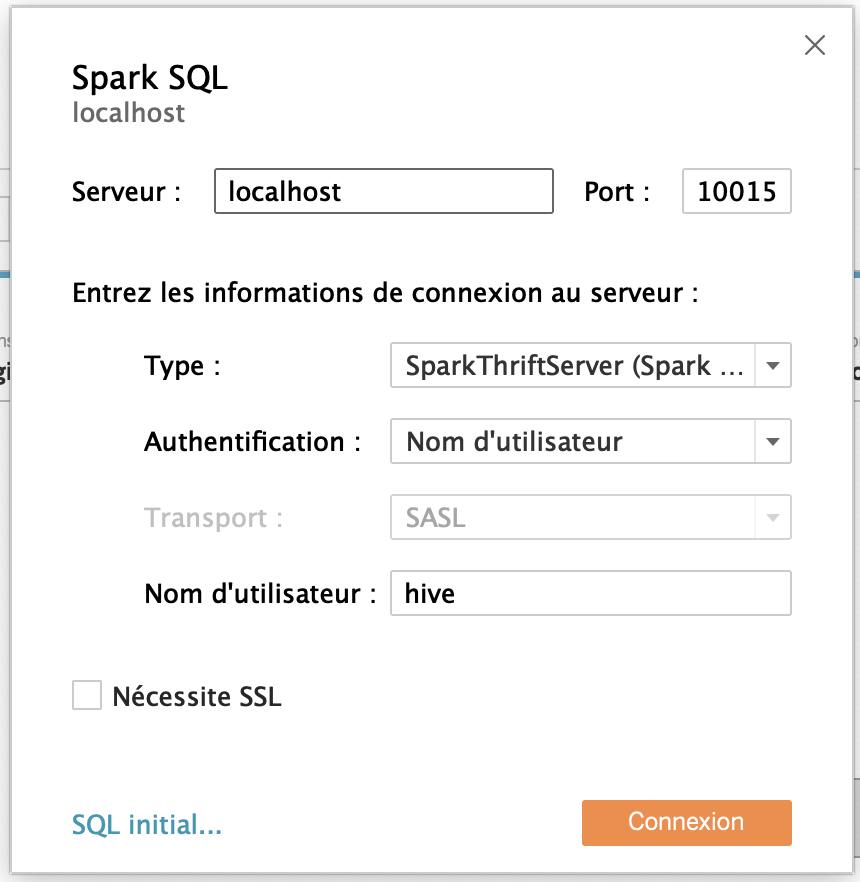

Afin de récupérer une vue temporaire créée depuis Spark, il est nécessaire d'ajouter une **Nouvelle requête SQL personnalisée** à la source de données. Elle doit avoir la forme suivante :

```sql
select * from [nom_de_la_table_désirée]
```

Création des différentes sources de données qui seront nécessaires au projet :
1. Partie 1 :
	* **global_awt** : Temps d'attente moyen pour la ligne L ;
	* **max_awt** : Station ayant le temps d'attente moyen le plus important sur la Ligne L, il s'agit d'une *inner join* entre les tables suivantes : *max_awt* et *stations_data* ;
	* **min_awt** : Station ayant le temps d'attente moyen le plus faible sur la Ligne L, il s'agit d'une *inner join* entre les tables suivantes : *min_awt* et *stations_data* ;
	* **ordered_awt** : Stations de la ligne L avec leur temps d'attente moyen, il s'agit d'une *inner join* entre les tables suivantes : *ordered_awt* et *stations_data*.
2. Partie 2 :
	* **stations_and_trains** : Stations et trains de la ligne L avec leurs positions, il s'agit d'une *full outer join* entre les tables suivantes : *trains_progression* et *stations_data* ;
	* **stations_and_trains_with_rail** : Stations et trains de la ligne L avec leurs positions, il s'agit d'une *full outer join* entre :
		* Une *union* du fichier CSV local *courbe-des-voies_L.csv* sur lui même
		* Et des tables suivantes : *trains_progression* et *stations_data* ;
	*  **trains_progression** : Trains de la ligne L avec leur progression.

Les *inner join* permettent des jointures classiques.

Les *full outer join* se font sur des conditions fictives toujours fausses, par exemple 0 = 1, afin d'afficher des données de différentes source sur une même feuille dans Tableau Desktop.

Les *union* permettent de dupliquer des données contenant des segments, du moins leur début et leur fin, afin de les afficher sous forme de ligne dans une feuille.

Dans ces trois cas, des colonnes calculées sont nécessaires afin d'assurer la cohérence des données lors de leur restitution.

Partie 1
--------------------

Les feuilles suivantes sont créées pour cette partie :
*  **AWT** : Affichage sous forme de *carte* des données de la source *ordered_awt*. Les stations sont colorées en fonction de leur temps d'attente moyen ;
* **TAB-AWT** : Affichage sous forme de *barres horizontales* des données de la source *ordered_awt*. Les stations sont colorées et ordonnées en fonction de leur temps d'attente moyen ;
* **MIN-AWT** : Affichage sous forme d'une *barre horizontale* de la donnée de la source *min_awt*. La ligne est colorée en fonction de son temps d'attente moyen ;
* **MAX-AWT** : Affichage sous forme d'une *barre horizontale* de la donnée de la source *max_awt*. La ligne est colorée en fonction de son temps d'attente moyen ;
* **GLO-AWT** : Affichage sous forme d'une *barre horizontale* de la donnée de la source *global_awt*. La ligne est colorée en fonction de son temps d'attente moyen ;

Elles sont rassemblées dans un unique tableau de bord **TAM-LIGNE-L** :

  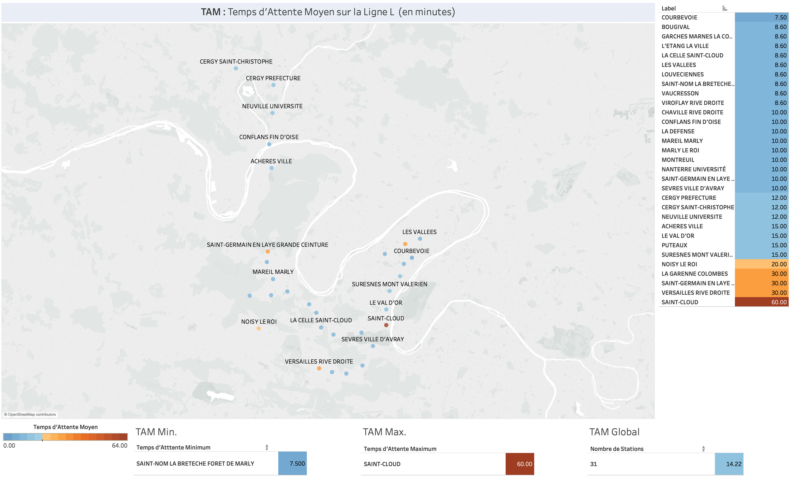

Partie 2
--------------------

Les feuilles suivantes sont créées pour cette partie :
* **TRAINS-PROG** : Affichage sous forme de *barres empilées* des données de la source *trains_progression*. Les trains sont colorés en fonction de leur progression via une échelle de couleur fixe, allant toujours de 0 à 100, et ordonnés en fonction de leur mission ;
* **TRAINS-POS** : Affichage sous forme de *carte* des données de la source *stations_and_trains*. Les stations sont différenciées des trains par leur forme et leur couleur ;
* **TRAINS-POS-WITH-RAIL** : Affichage sous forme de *carte* des données de la source *stations_and_trains_with_rail*. Les stations sont différenciées des trains et des rails par leur forme et leur couleur. Il est nécessaire d'avoir un axe double au niveau des lignes afin d'afficher sur une même feuille des *lignes* et des *formes*. La position des trains utilisée ici est celle *courante* ;
* **TRAINS-ACCURATE-POS-WITH-RAIL** : Affichage sous forme de *carte* des données de la source *stations_and_trains_with_rail*. Les stations sont différenciées des trains et des rails par leur forme et leur couleur. Il est nécessaire d'avoir un axe double au niveau des lignes afin d'afficher sur une même feuille des *lignes* et des *formes*. La position des trains utilisée ici est celle *affinée*.

Les tableaux de bord suivant sont créés pour cette partie :
* **POS-TRAINS-LIGNE-L** : Rassemble les feuilles *TRAINS-POS* et *TRAINS-PROG* ;

  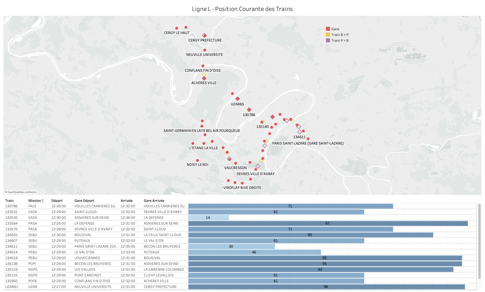

* **POS-TRAINS-LIGNE-L-WITH-RAIL** : Rassemble les feuilles *TRAINS-POS-WITH-RAIL* et *TRAINS-PROG* ;

  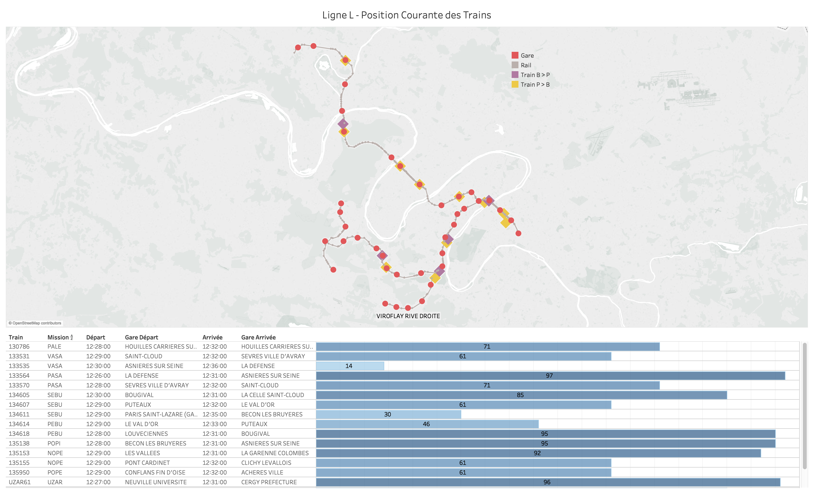

* **ACCURATE-POS-TRAINS-LIGNE-L-WITH-RAIL** : Rassemble les feuilles *TRAINS-ACCURATE-POS-WITH-RAIL* et *TRAINS-PROG* ;

  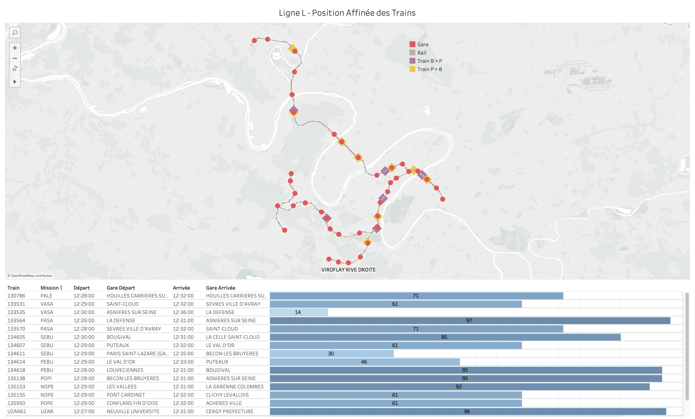

* **TRAINS-LIGNE-L-WITH-RAIL** : Rassemble les feuilles *TRAINS-POS-WITH-RAIL* et *TRAINS-ACCURATE-POS-WITH-RAIL*.

  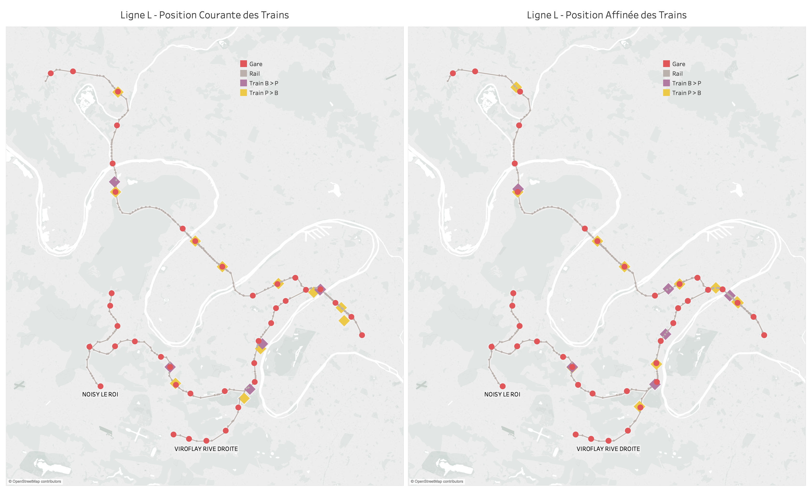

Histoire
--------------------

Les différents tableaux de bord présentés plus haut sont rassemblés dans une histoire **LIGNE-L** qui illustre les différentes parties de notre projet.


Traitement et exploitation des données SNCF pour les rails
=============

* Téléchargement des données sur les rails depuis le site [SNCF Open Data](https://ressources.data.sncf.com/explore/dataset/courbe-des-voies/table/).

  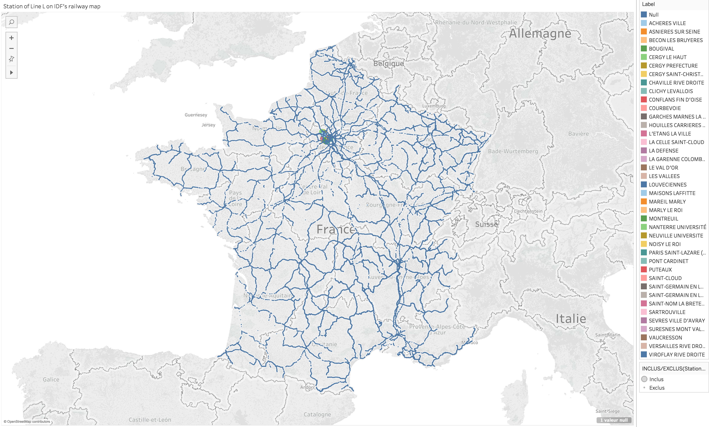

* Épuration des données afin de ne garder que les tronçons de la ligne L.

  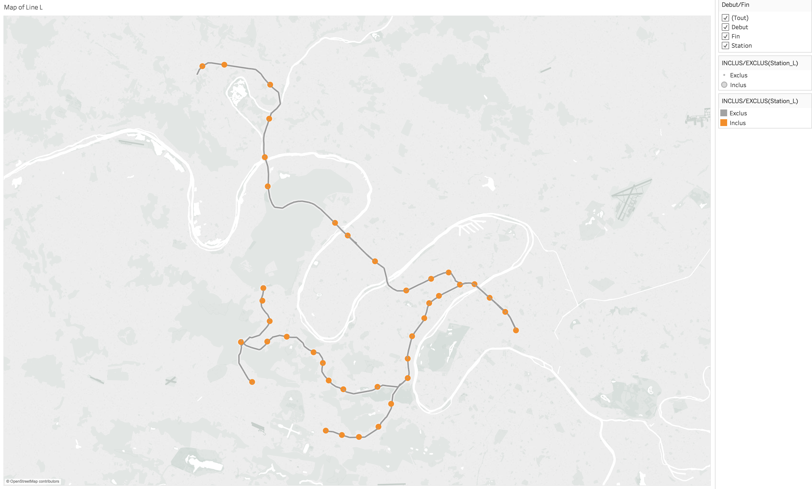

* Stockage de ces informations dans le fichier [*courbe-des-voies_L.csv*](../../tableau/courbe-des-voies_L.csv) qui sera ensuite exploité via Tableau Desktop.

* Extraction des géopoints uniques de ces segments entre les différentes gares de la ligne, ne sont gardés que ceux des lignes principales (NOM_VOIE = V1).

  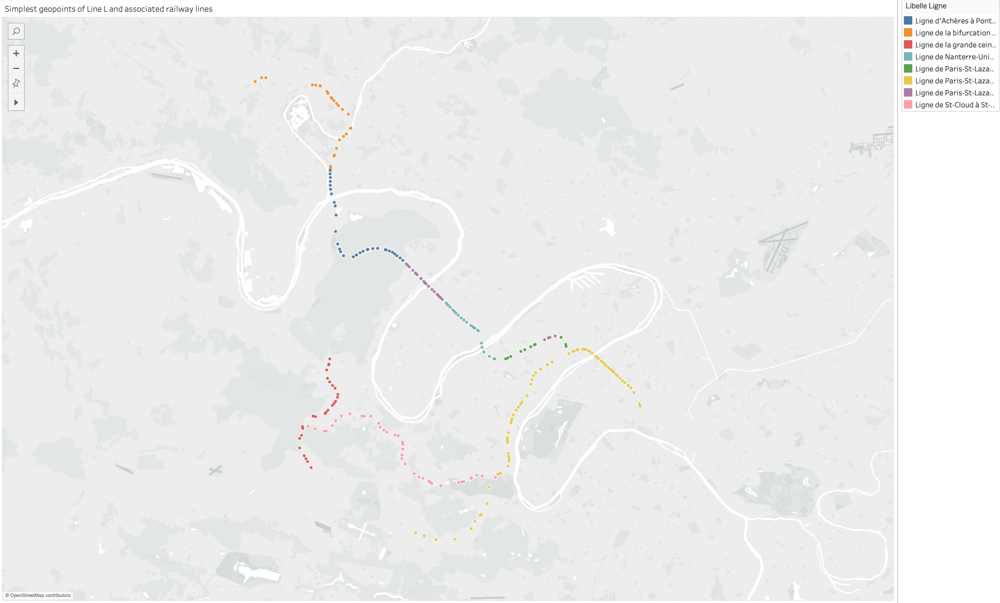

Calcul des suites de géopoints des trajets de la ligne L
--------------------

À partir de la structure de la ligne :

  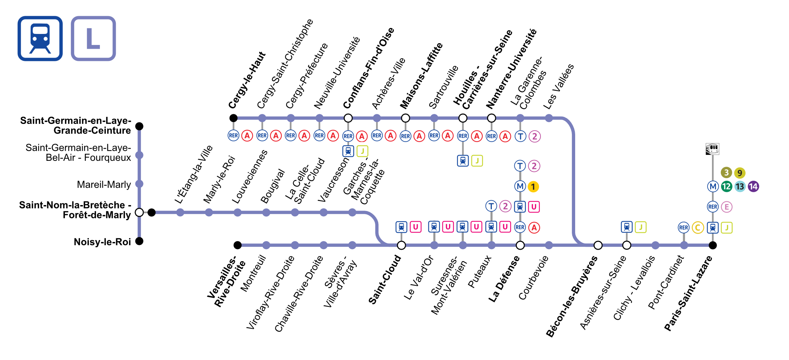

Définition des branches suivantes :
* **0** : de Paris-Saint-Lazare à Bécon-les-Bruyères ;
	* **00** : de Bécon-les-Bruyères à Cergy-le-Haut ;
	* **01** : de Bécon-les-Bruyères à Saint-Cloud ;
		* **010** : de Saint-Cloud à Saint-Nom-la-Bretèche-Forêt-de-Marly ;
			* **0100** : de Saint-Nom-la-Bretèche-Forêt-de-Marly à Saint-Germain-en-Laye-Grande-Ceinture ;
			* **0100** : de Saint-Nom-la-Bretèche-Forêt-de-Marly à Noisy-le-Roy ;
		* **011** : de Saint-Cloud à Versailles-Rive-Droite.

Ordonnancement des différentes stations sur leur branche respective en allant de Paris vers la banlieue.

Idem avec les géopoints extraits, voir plus haut.

Conception et développement d'un script **generate_geopoints_path_line_l.py** permettant à partir de ces informations de calculer tous les trajets possibles de la ligne L avec leurs géopoints ordonnés et de les sauvegarder dans un fichier **scnf-paths-line-l.json**. Le script se base sur une navigation récursive au sein d'un arbre modélisant la ligne.


Conclusion
======
A inclure dans la conclusion : pour mettre ce code en production, passer le code des notebooks en scripts Python à exécuter à l'aide de ``Spark submit``

> Written with [StackEdit](https://stackedit.io/).
